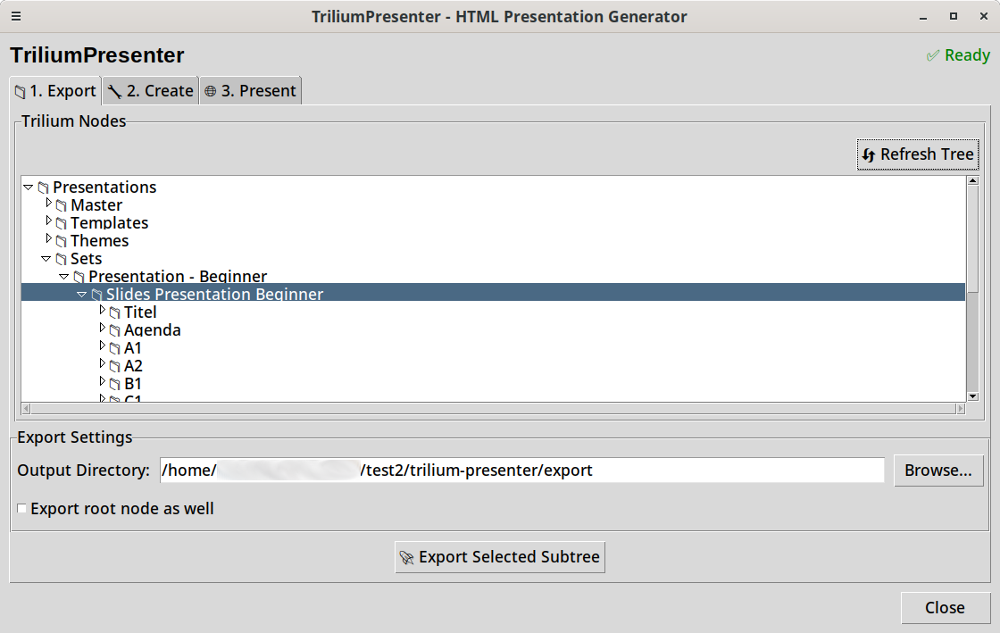

# Trilium Presenter


A modern Python tool for exporting [Trilium Notes](https://github.com/zadam/trilium) content and creating HTML presentations and PDF documents.



## Features

- **Reusable Slide Library** - Build once, reuse everywhere. Create a library of slides in Trilium and assemble different presentations by referencing them
- **Visual Node Selection** - Browse and export from Trilium's tree hierarchy
- **Dual Format Output** - Generate HTML presentations (16:9 Full HD) and PDF documents (A4)
- **Presenter Mode** - Speaker notes and overview for presentations
- **Custom Templates** - Configurable backgrounds and styles
- **Easy Install** - Automated setup with dependency management

## Quick Start

```bash
# Clone repository
git clone https://github.com/Stefan-Schmidbauer/trilium-presenter.git
cd trilium-presenter

# Run installer
./install.py

# Configure Trilium connection
cp .env.example .env
# Edit .env with your Trilium server URL and ETAPI token

# Start the application
./start.sh
```

**First time?** See the [Getting Started Guide](docs/GETTING_STARTED.md) for detailed installation, configuration, and first steps.

## Requirements

- **Python 3.11 or higher** (with pip and venv)
- **Trilium Notes** with ETAPI enabled
- **Linux system** (installer configured for Debian-based distributions)

See [Getting Started](docs/GETTING_STARTED.md) for complete installation instructions.

## Documentation

**New to Trilium Presenter?** Follow these guides in order:

1. [Getting Started](docs/GETTING_STARTED.md) - Installation, configuration, and first launch
2. [Trilium Organization](docs/TRILIUM_ORGANIZATION.md) - How to structure content in Trilium
3. [Markdown Syntax](docs/MARKDOWN_SYNTAX.md) - Formatting your presentations

**Advanced:**

- [Customization Guide](docs/CUSTOMIZATION.md) - Custom backgrounds, CSS, and templates
- [Claude Integration](docs/CLAUDE_INTEGRATION.md) - Automate content creation with Claude Code (includes a Claude Code agent for generating slides/worksheets directly in Trilium)

## Related Tools

- **[Trilium Notes](https://github.com/zadam/trilium)** - The great knowledge management system
- **[trilium-py](https://github.com/Nriver/trilium-py)** - Python client for Trilium ETAPI

## Contributing

Contributions are welcome! Fork the repository, make your changes, and submit a pull request.

## License

Copyright (c) 2025 Stefan Schmidbauer. Licensed under the [MIT License](LICENSE).

Built with the assistance of [Claude](https://claude.ai) by Anthropic.
