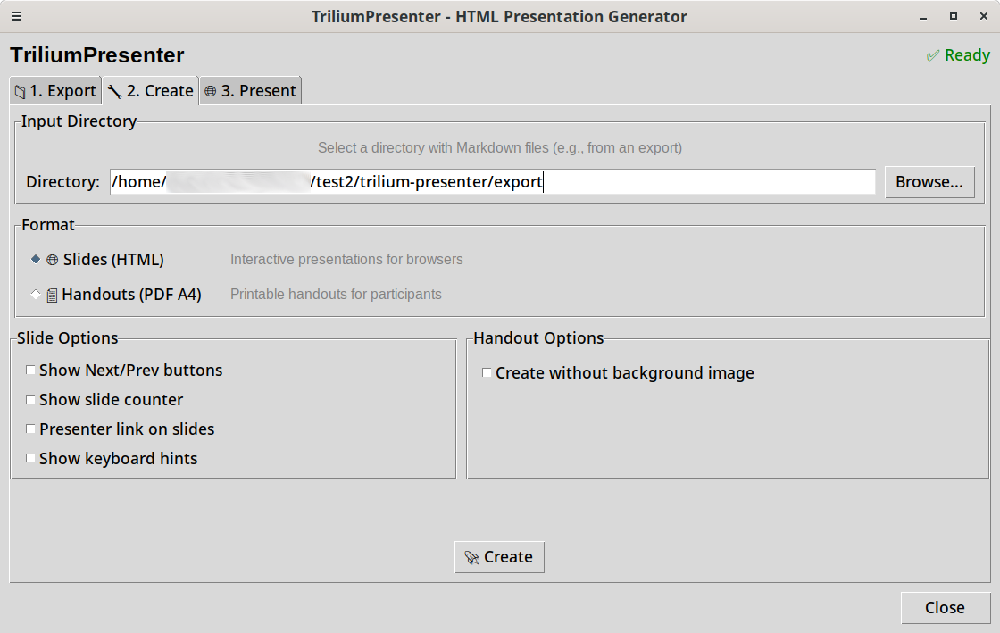
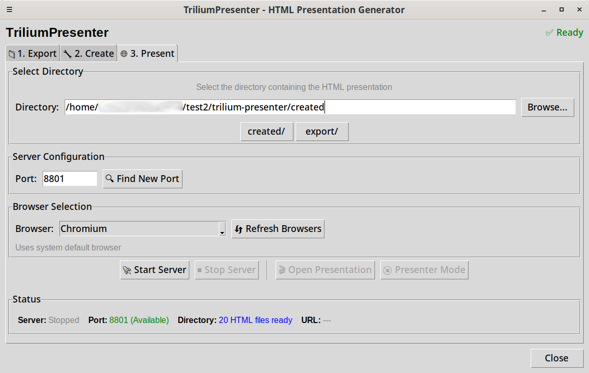

# Getting Started with Trilium Presenter

Complete installation, configuration, and first-launch guide for Trilium Presenter.

## Installation

### Prerequisites

Before installing, ensure you have:

- **Python 3.11 or higher** with pip and venv
- **Trilium Notes** running with ETAPI enabled
- **Linux system** with apt/deb package manager (installer is configured for Debian-based systems)

### Step 1: Clone the Repository

```bash
git clone https://github.com/Stefan-Schmidbauer/trilium-presenter.git
cd trilium-presenter
```

### Step 2: Run the Installer

```bash
./install.py
```

### What the Installer Does

The installation script automatically:

1. **Creates a virtual environment** (`venv/`) with Python dependencies
2. **Checks system dependencies** and provides the `sudo apt install` command if packages are missing (you need to run this manually)
3. **Installs Python packages** (PyYAML, trilium-py, weasyprint, markdown, beautifulsoup4, etc.)
4. **Copies example background images** to `config/html_templates/assets/` and `config/pdf_templates/assets/` if they don't already exist

The example backgrounds ensure you can start creating presentations immediately. You can customize them later (see [Customization Guide](CUSTOMIZATION.md)).

### Dependencies Reference

**Python dependencies** (auto-installed in venv):

- PyYAML, trilium-py, python-dotenv, requests
- markdown, markdown2, beautifulsoup4, markdownify
- weasyprint, pygments, latex2mathml
- natsort, tqdm

**System dependencies** (manual install via apt):

- python3-venv, libpango-1.0-0, libpangocairo-1.0-0
- libgdk-pixbuf2.0-0, libffi-dev, shared-mime-info

If you're on a non-Debian distribution, you'll need to find the equivalent packages for your package manager.

## Configuration

### Create .env File

Trilium Presenter requires connection credentials for your Trilium instance.

```bash
# Copy the example file
cp .env.example .env
```

### Step 3: Edit .env

Open `.env` and add your Trilium server details:

```env
TRILIUM_SERVER_URL=http://localhost:8080
TRILIUM_ETAPI_TOKEN=your_token_here
```

### How to Get Your ETAPI Token

1. Open Trilium Notes
2. Go to **Options** → **ETAPI** (top-right menu)
3. Click **Create new ETAPI token**
4. Copy the generated token
5. Paste it into your `.env` file as `TRILIUM_ETAPI_TOKEN`

**Important**: The `.env` file is the only place for Trilium credentials. It's already in `.gitignore` so it won't be committed to version control.

### Step 4: Test Your Connection

Verify that Trilium Presenter can connect to your Trilium instance:

```bash
# Replace YOUR_TOKEN with your actual ETAPI token
curl -H "Authorization: YOUR_TOKEN" http://localhost:8080/etapi/notes/root
```

If successful, you'll see JSON data about your root note. If it fails, check that:

- Trilium is running (open `http://localhost:8080` in your browser)
- Your `.env` file has the correct URL and token
- ETAPI is enabled in Trilium Options

## First Launch

### Step 5: Start the Application

```bash
./start.sh
```

The GUI will open with three tabs. Here's a quick overview of the workflow:

### Tab 1: Export from Trilium


The **Export** tab connects to your Trilium instance and allows you to select content:

1. **Browse your Trilium tree** in the left panel (hierarchical view of all your notes)
2. **Select a node** that represents your presentation content
3. **Click "Export Selected Subtree"** to export the content and all child notes
4. **Exported files** are saved to `export/[note_name]/` with markdown files and images

**Tip**: Organize your Trilium notes using the Master/Templates/Sets structure (see [Trilium Organization](TRILIUM_ORGANIZATION.md) for details).

### Tab 2: Create Presentations/Documents



The **Create** tab generates your presentation or document:

1. **Select input directory** (usually the folder you just exported - it's prefilled automatically)
2. **Choose format**:
   - **Slides (HTML)**: Interactive slides with navigation, presenter mode, and speaker notes
   - **Handouts (PDF A4)**: Printable document with all content in a static format
3. **Click "Create"** to create your output
4. **Generated files** are saved to `created`

The generator processes your markdown files and applies templates with backgrounds and styling.

### Tab 3: Present



The **Present** tab launches your HTML presentation:

1. **Select HTML directory** (the generated HTML presentation folder - prefilled automatically)
2. **Click "Start Server"** to launch a local web server (default port: 8800)
3. **Open browser** with two buttons:
   - **Open Presentation**: Clean slides for audience display
   - **Presenter Mode**: Slidelist with speaker notes
4. **Navigate through presentation** with keyboard (arrow keys, spacebar) or mouse clicks

**Keyboard shortcuts**:

- `→` / `↓` / `Space` / `Enter` / `PageDown`: Next slide
- `←` / `↑` / `Backspace` / `PageUp`: Previous slide
- `Home`: First slide
- `End`: Last slide
- `Escape`: Toggle fullscreen
- `h` / `?`: Show keyboard hint

**Touch navigation**: Swipe left/right or up/down in the bottom 10% of the screen to navigate slides.

## Next Steps

Now that you're set up, learn how to organize your content and use the application:

- **[Trilium Organization](TRILIUM_ORGANIZATION.md)** - How to structure notes in Trilium for presentations (Master/Templates/Sets concept)
- **[Markdown Syntax](MARKDOWN_SYNTAX.md)** - Learn the markdown syntax for creating slides
- **[Claude Code Integration](CLAUDE_INTEGRATION.md)** - Automate content creation with Claude Code (optional)
